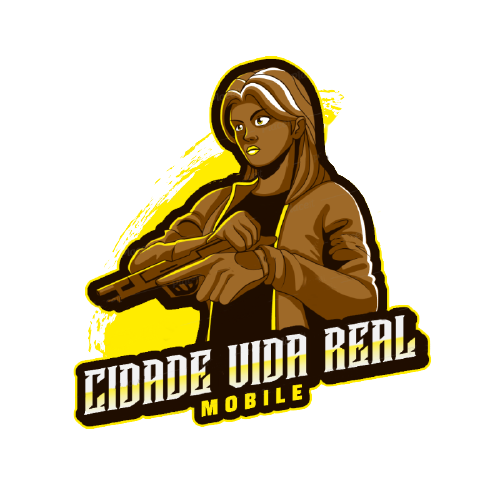

  

# Godot Mobile Prototype 3D

A prototype of a 3D game for mobile devices using the Godot engine.

- Translation: [Brazilian portuguese](./_docs/pt-BR/README.md)

## Newness

These are the latest updates that have been made to the game:

- Implementation of rotation in movement
- Fix a bug in mobile control
- Add a player movement animation

# Description

Welcome to the 3D virtual world Caribbean, in this world you can meet new people, build houses, fulfill your dreams and become a star. The game has a proposal to be an online simulator, where players can perform various activities to generate rewards.

# How to play

To play this game you must use the joystick to move around the scene.

# Gameplay

## Assets

- [Prototype Textures - kenney](https://www.kenney.nl/assets/prototype-textures)
- [Fantasy Skybox FREE](https://assetstore.unity.com/packages/2d/textures-materials/sky/fantasy-skybox-free-18353)
- [Mixamo](https://www.mixamo.com/)