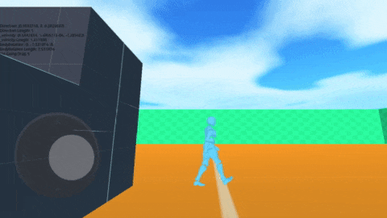

  

# Godot Mobile Prototype 3D

Um protótipo de um jogo 3D para dispositivos móveis utilizando o engine Godot.

## Novidades

Estas são as últimas atualizações que foram feitas ao jogo:

- Implementação da rotação do player em movimento
- Corrigir um erro no controlo móvel
- Foi adicionado uma animação de movimento para o jogador

# Descrição

Bem-vindo ao mundo virtual 3D Caraibas, neste mundo você pode conhecer novas pessoas, construir casas, realizar seus sonhos e se tornar uma estrela. O jogo tem a proposta de ser um simulador online, onde os jogadores podem realizar diversas atividades para gerar recompensas.

# Como jogar?

Para jogar este jogo deve usar o joystick para se deslocar pela cena do jogo.

# Gameplay

## Assets

- [Prototype Textures - kenney](https://www.kenney.nl/assets/prototype-textures)
- [Fantasy Skybox FREE](https://assetstore.unity.com/packages/2d/textures-materials/sky/fantasy-skybox-free-18353)
- [Mixamo](https://www.mixamo.com/)